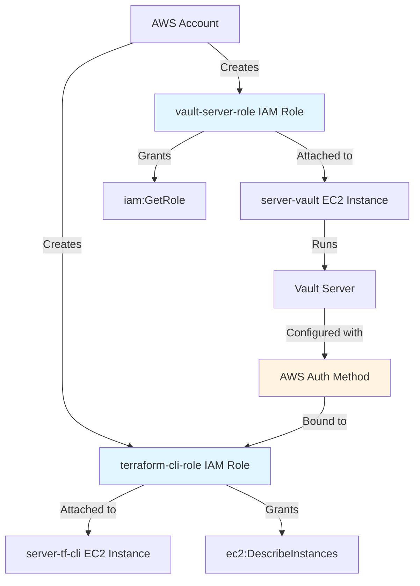

# AWS IAM Authentication Flow Diagram

This document contains a detailed Mermaid sequence diagram showing the complete trust building and message exchange between the Terraform Vault provider and Vault server using AWS IAM roles.

## Trust Building and Authentication Flow

```mermaid
sequenceDiagram
    participant TF as Terraform CLI<br/>(server-tf-cli)
    participant IMDS as EC2 Instance<br/>Metadata Service
    participant VP as Vault Provider<br/>(in Terraform)
    participant VS as Vault Server<br/>(server-vault)
    participant STS as AWS STS API<br/>(sts:GetCallerIdentity)
    participant IAM as AWS IAM API<br/>(iam:GetRole)

    Note over TF,IAM: Phase 1: Trust Setup (Done during infrastructure deployment)

    rect rgb(240, 248, 255)
        Note over TF: EC2 Instance Profile:<br/>terraform-cli-role
        Note over VS: EC2 Instance Profile:<br/>vault-server-role
        Note over VS: Vault Auth Role Config:<br/>bound_iam_principal_arn=<br/>terraform-cli-role
    end

    Note over TF,IAM: Phase 2: Terraform Execution Begins

    TF->>TF: User runs 'terraform apply'
    TF->>VP: Initialize Vault provider

    Note over VP: Provider config:<br/>auth_login_aws {<br/>  role = "terraform-cli"<br/>  header_value = "https://..."<br/>}

    Note over TF,IAM: Phase 3: AWS Credential Retrieval

    VP->>IMDS: GET /latest/api/token<br/>(Request IMDSv2 token)
    IMDS-->>VP: Session token

    VP->>IMDS: GET /latest/meta-data/iam/security-credentials/<br/>terraform-cli-role<br/>(with IMDSv2 token header)
    IMDS-->>VP: Temporary AWS Credentials:<br/>- AccessKeyId<br/>- SecretAccessKey<br/>- Token (session token)<br/>- Expiration

    Note over TF,IAM: Phase 4: Create Signed STS Request

    VP->>VP: Prepare STS GetCallerIdentity request:<br/>- Method: POST<br/>- Headers: Authorization, X-Amz-Date,<br/>  X-Vault-AWS-IAM-Server-ID<br/>- Sign request using AWS SigV4

    Note over VP: Signed request includes:<br/>1. AWS Access Key ID<br/>2. Session Token<br/>3. Cryptographic Signature<br/>4. Timestamp<br/>5. Header Value (SSRF protection)

    Note over TF,IAM: Phase 5: Vault Login with AWS Auth Method

    VP->>VS: POST /v1/auth/aws/login<br/>Body: {<br/>  "role": "terraform-cli",<br/>  "iam_http_request_method": "POST",<br/>  "iam_request_url": base64(STS URL),<br/>  "iam_request_body": base64(signed request),<br/>  "iam_request_headers": base64(headers)<br/>}

    Note over VS: Vault receives the signed<br/>AWS STS request

    Note over TF,IAM: Phase 6: Vault Validates Identity with AWS

    VS->>VS: Extract IAM request from login payload
    VS->>VS: Verify X-Vault-AWS-IAM-Server-ID<br/>matches expected value

    VS->>STS: Submit exact signed request:<br/>POST sts:GetCallerIdentity<br/>(with original signature)

    Note over STS: AWS validates:<br/>1. Signature authenticity<br/>2. Access key is valid<br/>3. Session token is valid<br/>4. Credentials not expired

    STS-->>VS: Response: {<br/>  "UserId": "AIDA...:i-xxx",<br/>  "Account": "123456789012",<br/>  "Arn": "arn:aws:sts::123456789012:<br/>assumed-role/terraform-cli-role/i-xxx"<br/>}

    Note over TF,IAM: Phase 7: Vault Validates IAM Role (Optional)

    VS->>VS: Extract role ARN from STS response:<br/>terraform-cli-role

    VS->>IAM: GetRole(terraform-cli-role)<br/>(using vault-server-role credentials)

    IAM-->>VS: Role details and policies

    Note over VS: Vault uses vault-server-role<br/>IAM permissions to verify<br/>the client role exists

    Note over TF,IAM: Phase 8: Vault Authorizes and Issues Token

    VS->>VS: Match extracted ARN against<br/>auth/aws/role/terraform-cli config:<br/>bound_iam_principal_arn =<br/>"arn:aws:iam::123456789012:<br/>role/terraform-cli-role"

    Note over VS: ARN matches! Grant access

    VS->>VS: Create Vault token with:<br/>- Policies: [default, terraform-access]<br/>- TTL: 24h<br/>- Renewable: true<br/>- Type: service token

    VS-->>VP: Response: {<br/>  "auth": {<br/>    "client_token": "hvs.xxx",<br/>    "policies": ["default", "terraform-access"],<br/>    "lease_duration": 86400,<br/>    "renewable": true<br/>  }<br/>}

    Note over VP: Store token in memory<br/>(skip_child_token = true,<br/>use login token directly)

    Note over TF,IAM: Phase 9: Access Vault Secrets

    VP->>VS: GET /v1/secret/data/myapp<br/>Header: X-Vault-Token: hvs.xxx

    VS->>VS: Validate token:<br/>1. Token exists and not expired<br/>2. Token has terraform-access policy<br/>3. Policy allows read on secret/data/myapp

    VS-->>VP: Response: {<br/>  "data": {<br/>    "data": {<br/>      "username": "demouser",<br/>      "password": "demopassword",<br/>      "environment": "production"<br/>    },<br/>    "metadata": {...}<br/>  }<br/>}

    VP-->>TF: Return secret data as<br/>Terraform data source values

    Note over TF,IAM: Phase 10: Token Renewal (Automatic)

    loop Token TTL < Threshold
        VP->>VS: POST /v1/auth/token/renew-self<br/>Header: X-Vault-Token: hvs.xxx
        VS-->>VP: Extended token TTL
        Note over VP: Token automatically renewed<br/>by provider before expiration
    end

    Note over TF,IAM: Phase 11: Session Cleanup

    TF->>TF: Terraform apply completes
    VP->>VP: Discard token from memory<br/>(no explicit revocation)

    Note over VS: Token remains valid until TTL expires<br/>or explicitly revoked
```



## Key Security Mechanisms

### 1. Trust Establishment (Infrastructure Layer)



### 2. Cryptographic Trust Chain

```mermaid
graph LR
    A[EC2 Instance Metadata] -->|Provides| B[Temporary AWS Credentials]
    B -->|Signs| C[STS Request with AWS SigV4]
    C -->|Sent to| D[Vault Server]
    D -->|Forwards to| E[AWS STS]
    E -->|Validates Signature| F[Returns Caller Identity]
    F -->|Proves| G[IAM Role Membership]
    G -->|Grants| H[Vault Token]

    style C fill:#ffe1e1
    style E fill:#e1ffe1
    style H fill:#fff4e1
```



## Important Configuration Details

### Vault Server Configuration

**Location**: `scripts/vault_server_setup.sh:129-133`

```bash
vault write auth/aws/role/terraform-cli \
  auth_type=iam \
  bound_iam_principal_arn="arn:aws:iam::${aws_account_id}:role/terraform-cli-role" \
  policies=default,terraform-access \
  ttl=24h
```

**Key Parameters**:
- `auth_type=iam`: Uses IAM authentication (not EC2 instance metadata)
- `bound_iam_principal_arn`: Exact IAM role ARN that's allowed to authenticate
- `policies`: Vault policies granted upon successful authentication
- `ttl`: Token lifetime (24 hours, automatically renewable)

### Terraform Provider Configuration

**Location**: `sample-terraform/main.tf:37-46`

```hcl
provider "vault" {
  address = "https://${vault_server_dns}:8200"
  skip_tls_verify = true
  skip_child_token = true

  auth_login_aws {
    role = "terraform-cli"
    header_value = "https://${vault_server_dns}:8200"
  }
}
```

**Key Parameters**:
- `skip_child_token = true`: Use login token directly (recommended for AWS IAM auth)
- `role`: Name of Vault AWS auth role to use
- `header_value`: SSRF protection - must match Vault's expected value

### IAM Policies

**Terraform CLI Role** (`main.tf:224-235`):
```json
{
  "Version": "2012-10-17",
  "Statement": [
    {
      "Action": ["ec2:DescribeInstances"],
      "Effect": "Allow",
      "Resource": "*"
    }
  ]
}
```
*Purpose*: Required for Vault to verify the instance's IAM role attachment

**Vault Server Role** (`main.tf:187-198`):
```json
{
  "Version": "2012-10-17",
  "Statement": [
    {
      "Effect": "Allow",
      "Action": ["iam:GetRole"],
      "Resource": "arn:aws:iam::*:role/terraform-cli-role"
    }
  ]
}
```
*Purpose*: Allows Vault to retrieve IAM role information to validate the principal

## Security Benefits

1. **No Static Secrets**: Zero long-lived credentials stored anywhere
2. **AWS-Native Trust**: Leverages AWS's cryptographic identity verification
3. **Automatic Rotation**: EC2 instance credentials rotate automatically
4. **Audit Trail**: Full visibility in both AWS CloudTrail and Vault audit logs
5. **SSRF Protection**: Header value prevents request replay attacks
6. **Principle of Least Privilege**: Each role has minimal required permissions
7. **Time-Limited Access**: Tokens expire and must be renewed
8. **Cryptographic Proof**: AWS signature validates identity without sharing secrets

## Token Lifecycle

| Phase | Duration | Description |
|-------|----------|-------------|
| **Authentication** | ~2-3 seconds | Provider retrieves credentials and authenticates |
| **Active Use** | Throughout Terraform execution | Token used for all Vault operations |
| **Renewal** | Automatic (before expiration) | Provider renews token as needed |
| **Expiration** | 24 hours after last renewal | Token becomes invalid |
| **Cleanup** | On Terraform exit | Token discarded from memory |

## Comparison: With vs Without skip_child_token

### Without skip_child_token (default)
```
Authentication → Login Token → Child Token → Secret Access
                                    ↑
                                Used for operations
```
- Creates an additional token
- Extra API call overhead
- More entries in audit logs
- Traditional Vault pattern

### With skip_child_token = true (recommended for AWS IAM)
```
Authentication → Login Token → Secret Access
                      ↑
                  Used directly
```
- Simpler token management
- Better performance
- Cleaner audit logs
- Optimal for cloud-native auth methods

## References

- AWS SigV4 Signing Process: [AWS Documentation](https://docs.aws.amazon.com/general/latest/gr/signature-version-4.html)
- Vault AWS Auth Method: [HashiCorp Documentation](https://developer.hashicorp.com/vault/docs/auth/aws)
- EC2 Instance Metadata Service (IMDSv2): [AWS Documentation](https://docs.aws.amazon.com/AWSEC2/latest/UserGuide/configuring-instance-metadata-service.html)
